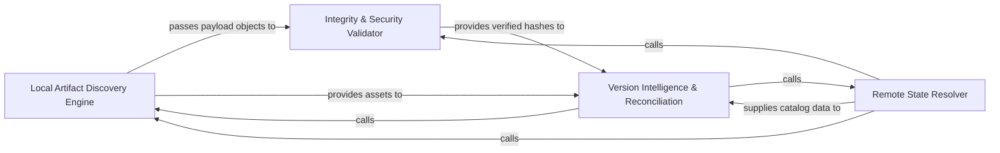

## Details

Responsible for scanning the local filesystem to identify compiled plugin assets and performing integrity checks using cryptographic hashing.

### Local Artifact Discovery Engine
Scans the local build environment to identify compiled plugin assets and maps them into structured payload objects based on the project's catalog definitions.

**Related Classes/Methods**:

- `app.scripts.upload_plugins.find_local_plugin_payloads`:346-360
- `app.scripts.upload_plugins.LocalPluginPayload`:259-273

**Source Files:**

- [`app/scripts/upload_plugins.py`](https://github.com/JLanders96/agentic-integrated-workstation/blob/main/.codeboardingapp/scripts/upload_plugins.py)
  - `app.scripts.upload_plugins.fail` ([L29-L31](https://github.com/JLanders96/agentic-integrated-workstation/blob/main/.codeboardingapp/scripts/upload_plugins.py#L29-L31)) - Function
  - `app.scripts.upload_plugins.LocalPluginPayload` ([L259-L273](https://github.com/JLanders96/agentic-integrated-workstation/blob/main/.codeboardingapp/scripts/upload_plugins.py#L259-L273)) - Class
  - `app.scripts.upload_plugins.LocalPluginPayload.selection_key` ([L272-L273](https://github.com/JLanders96/agentic-integrated-workstation/blob/main/.codeboardingapp/scripts/upload_plugins.py#L272-L273)) - Method
  - `app.scripts.upload_plugins.resolve_selected_plugins` ([L455-L501](https://github.com/JLanders96/agentic-integrated-workstation/blob/main/.codeboardingapp/scripts/upload_plugins.py#L455-L501)) - Function

### Integrity & Security Validator
Performs cryptographic verification and network reachability checks to ensure the physical integrity and addressability of plugin artifacts.

**Related Classes/Methods**:

- `app.scripts.upload_plugins.compute_sha256`:200-205
- `app.scripts.upload_plugins.verify_publish_urls`:386-409

**Source Files:**

- [`app/scripts/upload_plugins.py`](https://github.com/JLanders96/agentic-integrated-workstation/blob/main/.codeboardingapp/scripts/upload_plugins.py)
  - `app.scripts.upload_plugins.load_json_file` ([L181-L183](https://github.com/JLanders96/agentic-integrated-workstation/blob/main/.codeboardingapp/scripts/upload_plugins.py#L181-L183)) - Function
  - `app.scripts.upload_plugins.compute_sha256` ([L200-L205](https://github.com/JLanders96/agentic-integrated-workstation/blob/main/.codeboardingapp/scripts/upload_plugins.py#L200-L205)) - Function

### Remote State Resolver
Synchronizes with the remote environment to fetch the current Source of Truth regarding deployed plugins and supported build targets.

**Related Classes/Methods**: _None_

**Source Files:**

- [`app/scripts/upload_plugins.py`](https://github.com/JLanders96/agentic-integrated-workstation/blob/main/.codeboardingapp/scripts/upload_plugins.py)
  - `app.scripts.upload_plugins.find_local_plugin_payloads_for_category` ([L298-L343](https://github.com/JLanders96/agentic-integrated-workstation/blob/main/.codeboardingapp/scripts/upload_plugins.py#L298-L343)) - Function
  - `app.scripts.upload_plugins.verify_archive` ([L363-L383](https://github.com/JLanders96/agentic-integrated-workstation/blob/main/.codeboardingapp/scripts/upload_plugins.py#L363-L383)) - Function
  - `app.scripts.upload_plugins.verify_publish_urls` ([L386-L409](https://github.com/JLanders96/agentic-integrated-workstation/blob/main/.codeboardingapp/scripts/upload_plugins.py#L386-L409)) - Function

### Version Intelligence & Reconciliation
The central logic engine that compares local artifacts against remote state to determine the necessary synchronization actions.

**Related Classes/Methods**: _None_

**Source Files:**

- [`app/scripts/upload_plugins.py`](https://github.com/JLanders96/agentic-integrated-workstation/blob/main/.codeboardingapp/scripts/upload_plugins.py)
  - `app.scripts.upload_plugins.normalize_url` ([L38-L41](https://github.com/JLanders96/agentic-integrated-workstation/blob/main/.codeboardingapp/scripts/upload_plugins.py#L38-L41)) - Function
  - `app.scripts.upload_plugins.ensure_url_under_base` ([L243-L246](https://github.com/JLanders96/agentic-integrated-workstation/blob/main/.codeboardingapp/scripts/upload_plugins.py#L243-L246)) - Function
  - `app.scripts.upload_plugins.find_local_plugin_payloads` ([L346-L360](https://github.com/JLanders96/agentic-integrated-workstation/blob/main/.codeboardingapp/scripts/upload_plugins.py#L346-L360)) - Function

### [FAQ](https://github.com/CodeBoarding/GeneratedOnBoardings/tree/main?tab=readme-ov-file#faq)