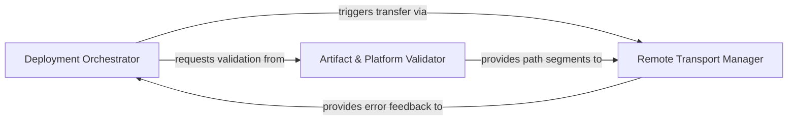

## Details

Manages the high-level execution flow and decision logic for the deployment process, acting as the central brain for versioning and compatibility.

### Deployment Orchestrator
Manages the high-level execution state and decision logic for plugin deployments.

**Related Classes/Methods**:

- `app.scripts.upload_plugins.main`:670-731
- `app.scripts.upload_plugins.decide_actions`:513-577
- `app.scripts.upload_plugins.compare_versions`:143-165

**Source Files:**

- [`app/scripts/gen_run_wrapper.py`](https://github.com/JLanders96/agentic-integrated-workstation/blob/main/.codeboardingapp/scripts/gen_run_wrapper.py)
  - `app.scripts.gen_run_wrapper.main` ([L7-L23](https://github.com/JLanders96/agentic-integrated-workstation/blob/main/.codeboardingapp/scripts/gen_run_wrapper.py#L7-L23)) - Function
- [`app/scripts/upload_plugins.py`](https://github.com/JLanders96/agentic-integrated-workstation/blob/main/.codeboardingapp/scripts/upload_plugins.py)
  - `app.scripts.upload_plugins.info` ([L34-L35](https://github.com/JLanders96/agentic-integrated-workstation/blob/main/.codeboardingapp/scripts/upload_plugins.py#L34-L35)) - Function
  - `app.scripts.upload_plugins.compare_versions` ([L143-L165](https://github.com/JLanders96/agentic-integrated-workstation/blob/main/.codeboardingapp/scripts/upload_plugins.py#L143-L165)) - Function
  - `app.scripts.upload_plugins.compare_versions.parse` ([L144-L151](https://github.com/JLanders96/agentic-integrated-workstation/blob/main/.codeboardingapp/scripts/upload_plugins.py#L144-L151)) - Function
  - `app.scripts.upload_plugins.decide_actions` ([L513-L577](https://github.com/JLanders96/agentic-integrated-workstation/blob/main/.codeboardingapp/scripts/upload_plugins.py#L513-L577)) - Function
  - `app.scripts.upload_plugins.rsync_upload` ([L627-L644](https://github.com/JLanders96/agentic-integrated-workstation/blob/main/.codeboardingapp/scripts/upload_plugins.py#L627-L644)) - Function
  - `app.scripts.upload_plugins.build_arg_parser` ([L647-L667](https://github.com/JLanders96/agentic-integrated-workstation/blob/main/.codeboardingapp/scripts/upload_plugins.py#L647-L667)) - Function
  - `app.scripts.upload_plugins.main` ([L670-L731](https://github.com/JLanders96/agentic-integrated-workstation/blob/main/.codeboardingapp/scripts/upload_plugins.py#L670-L731)) - Function

### Artifact & Platform Validator
Ensures structural integrity and environmental compatibility of plugin artifacts.

**Related Classes/Methods**:

- `app.scripts.upload_plugins.BuildTarget`:250-255
- `app.scripts.upload_plugins.verify_build_artifact`:412-437
- `app.scripts.upload_plugins.current_platform`:94-102

**Source Files:**

- [`app/scripts/upload_plugins.py`](https://github.com/JLanders96/agentic-integrated-workstation/blob/main/.codeboardingapp/scripts/upload_plugins.py)
  - `app.scripts.upload_plugins.current_platform` ([L94-L102](https://github.com/JLanders96/agentic-integrated-workstation/blob/main/.codeboardingapp/scripts/upload_plugins.py#L94-L102)) - Function
  - `app.scripts.upload_plugins.current_architecture` ([L105-L114](https://github.com/JLanders96/agentic-integrated-workstation/blob/main/.codeboardingapp/scripts/upload_plugins.py#L105-L114)) - Function
  - `app.scripts.upload_plugins.BuildTarget` ([L250-L255](https://github.com/JLanders96/agentic-integrated-workstation/blob/main/.codeboardingapp/scripts/upload_plugins.py#L250-L255)) - Class
  - `app.scripts.upload_plugins.load_build_targets` ([L276-L295](https://github.com/JLanders96/agentic-integrated-workstation/blob/main/.codeboardingapp/scripts/upload_plugins.py#L276-L295)) - Function
  - `app.scripts.upload_plugins.verify_build_artifact` ([L412-L437](https://github.com/JLanders96/agentic-integrated-workstation/blob/main/.codeboardingapp/scripts/upload_plugins.py#L412-L437)) - Function

### Remote Transport Manager
Handles low-level remote file system interaction and data movement synchronization.

**Related Classes/Methods**:

- `app.scripts.upload_plugins.rsync_upload`:627-644
- `app.scripts.upload_plugins.remote_parent_dir`:51-61
- `app.scripts.upload_plugins.format_rsync_error`:64-91

**Source Files:**

- [`app/scripts/upload_plugins.py`](https://github.com/JLanders96/agentic-integrated-workstation/blob/main/.codeboardingapp/scripts/upload_plugins.py)
  - `app.scripts.upload_plugins.split_remote_dir` ([L44-L48](https://github.com/JLanders96/agentic-integrated-workstation/blob/main/.codeboardingapp/scripts/upload_plugins.py#L44-L48)) - Function
  - `app.scripts.upload_plugins.remote_parent_dir` ([L51-L61](https://github.com/JLanders96/agentic-integrated-workstation/blob/main/.codeboardingapp/scripts/upload_plugins.py#L51-L61)) - Function
  - `app.scripts.upload_plugins.format_rsync_error` ([L64-L91](https://github.com/JLanders96/agentic-integrated-workstation/blob/main/.codeboardingapp/scripts/upload_plugins.py#L64-L91)) - Function

### [FAQ](https://github.com/CodeBoarding/GeneratedOnBoardings/tree/main?tab=readme-ov-file#faq)