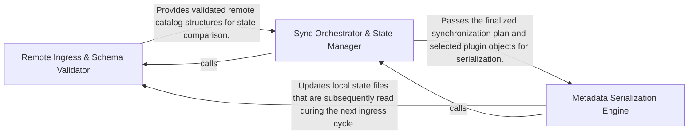

## Details

Handles communication with external repositories to synchronize the plugin catalog and manages metadata serialization.

### Remote Ingress & Schema Validator
Responsible for the secure acquisition of remote catalog data and its transformation into validated internal structures.

**Related Classes/Methods**:

- `app.scripts.upload_plugins.fetch_remote_catalog`:504-510
- `app.scripts.upload_plugins.parse_catalog`:208-216

**Source Files:**

- [`app/scripts/upload_plugins.py`](https://github.com/JLanders96/agentic-integrated-workstation/blob/main/.codeboardingapp/scripts/upload_plugins.py)
  - `app.scripts.upload_plugins.normalize_list` ([L117-L133](https://github.com/JLanders96/agentic-integrated-workstation/blob/main/.codeboardingapp/scripts/upload_plugins.py#L117-L133)) - Function
  - `app.scripts.upload_plugins.fetch_url` ([L168-L178](https://github.com/JLanders96/agentic-integrated-workstation/blob/main/.codeboardingapp/scripts/upload_plugins.py#L168-L178)) - Function
  - `app.scripts.upload_plugins.fetch_json_url` ([L186-L190](https://github.com/JLanders96/agentic-integrated-workstation/blob/main/.codeboardingapp/scripts/upload_plugins.py#L186-L190)) - Function
  - `app.scripts.upload_plugins.fetch_text_url` ([L193-L197](https://github.com/JLanders96/agentic-integrated-workstation/blob/main/.codeboardingapp/scripts/upload_plugins.py#L193-L197)) - Function
  - `app.scripts.upload_plugins.choose_plugins_interactively` ([L440-L452](https://github.com/JLanders96/agentic-integrated-workstation/blob/main/.codeboardingapp/scripts/upload_plugins.py#L440-L452)) - Function
  - `app.scripts.upload_plugins.fetch_remote_catalog` ([L504-L510](https://github.com/JLanders96/agentic-integrated-workstation/blob/main/.codeboardingapp/scripts/upload_plugins.py#L504-L510)) - Function

### Sync Orchestrator & State Manager
The logic engine that determines the delta between local and remote states, performs version comparisons, and provides interactive logic for plugin synchronization.

**Related Classes/Methods**:

- `app.scripts.upload_plugins.choose_plugins_interactively`:440-452

**Source Files:**

- [`app/scripts/upload_plugins.py`](https://github.com/JLanders96/agentic-integrated-workstation/blob/main/.codeboardingapp/scripts/upload_plugins.py)
  - `app.scripts.upload_plugins.runtime_key` ([L136-L140](https://github.com/JLanders96/agentic-integrated-workstation/blob/main/.codeboardingapp/scripts/upload_plugins.py#L136-L140)) - Function
  - `app.scripts.upload_plugins.parse_catalog` ([L208-L216](https://github.com/JLanders96/agentic-integrated-workstation/blob/main/.codeboardingapp/scripts/upload_plugins.py#L208-L216)) - Function
  - `app.scripts.upload_plugins.serialize_catalog` ([L219-L220](https://github.com/JLanders96/agentic-integrated-workstation/blob/main/.codeboardingapp/scripts/upload_plugins.py#L219-L220)) - Function
  - `app.scripts.upload_plugins.parse_checksums` ([L223-L235](https://github.com/JLanders96/agentic-integrated-workstation/blob/main/.codeboardingapp/scripts/upload_plugins.py#L223-L235)) - Function

### Metadata Serialization Engine
Handles the egress of metadata by converting internal plugin states back into standardized JSON formats for persistence or remote upload.

**Related Classes/Methods**:

- `app.scripts.upload_plugins.serialize_catalog`:219-220

**Source Files:**

- [`app/scripts/upload_plugins.py`](https://github.com/JLanders96/agentic-integrated-workstation/blob/main/.codeboardingapp/scripts/upload_plugins.py)
  - `app.scripts.upload_plugins.serialize_checksums` ([L238-L240](https://github.com/JLanders96/agentic-integrated-workstation/blob/main/.codeboardingapp/scripts/upload_plugins.py#L238-L240)) - Function
  - `app.scripts.upload_plugins.stage_upload` ([L580-L624](https://github.com/JLanders96/agentic-integrated-workstation/blob/main/.codeboardingapp/scripts/upload_plugins.py#L580-L624)) - Function

### [FAQ](https://github.com/CodeBoarding/GeneratedOnBoardings/tree/main?tab=readme-ov-file#faq)