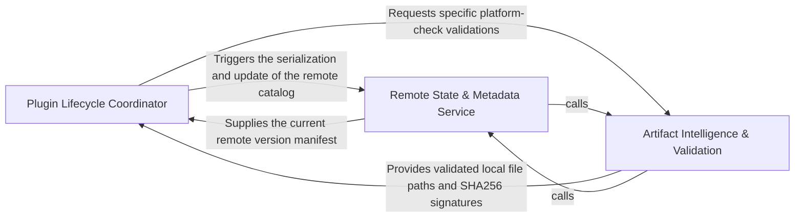
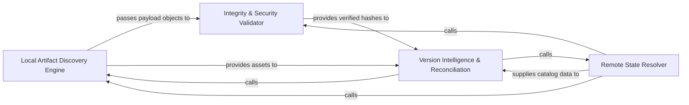
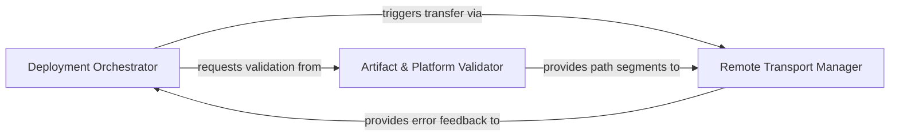
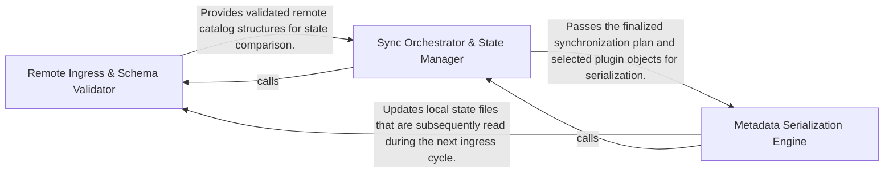

## Details

The agentic-integrated-workstation plugin distribution system uses a Coordinator-Service pattern to synchronize local build artifacts with remote repositories. It orchestrates a pipeline that discovers and validates local plugins, compares them against a remote catalog, and performs secure transfers to ensure only verified, compatible plugins are deployed.

### Plugin Lifecycle Coordinator [[Expand]](./Plugin_Lifecycle_Coordinator.md)
Manages the high-level execution flow and decision logic for the deployment process, acting as the central brain for versioning and compatibility.

**Related Classes/Methods**:

- `app.scripts.upload_plugins.main`:670-731
- `app.scripts.upload_plugins.decide_actions`:513-577
- `app.scripts.upload_plugins.verify_build_artifact`:412-437
- `app.scripts.upload_plugins.rsync_upload`:627-644

**Source Files:**

- [`app/scripts/gen_run_wrapper.py`](https://github.com/JLanders96/agentic-integrated-workstation/blob/main/.codeboardingapp/scripts/gen_run_wrapper.py)
  - `app.scripts.gen_run_wrapper.main` ([L7-L23](https://github.com/JLanders96/agentic-integrated-workstation/blob/main/.codeboardingapp/scripts/gen_run_wrapper.py#L7-L23)) - Function
- [`app/scripts/upload_plugins.py`](https://github.com/JLanders96/agentic-integrated-workstation/blob/main/.codeboardingapp/scripts/upload_plugins.py)
  - `app.scripts.upload_plugins.info` ([L34-L35](https://github.com/JLanders96/agentic-integrated-workstation/blob/main/.codeboardingapp/scripts/upload_plugins.py#L34-L35)) - Function
  - `app.scripts.upload_plugins.split_remote_dir` ([L44-L48](https://github.com/JLanders96/agentic-integrated-workstation/blob/main/.codeboardingapp/scripts/upload_plugins.py#L44-L48)) - Function
  - `app.scripts.upload_plugins.remote_parent_dir` ([L51-L61](https://github.com/JLanders96/agentic-integrated-workstation/blob/main/.codeboardingapp/scripts/upload_plugins.py#L51-L61)) - Function
  - `app.scripts.upload_plugins.format_rsync_error` ([L64-L91](https://github.com/JLanders96/agentic-integrated-workstation/blob/main/.codeboardingapp/scripts/upload_plugins.py#L64-L91)) - Function
  - `app.scripts.upload_plugins.current_platform` ([L94-L102](https://github.com/JLanders96/agentic-integrated-workstation/blob/main/.codeboardingapp/scripts/upload_plugins.py#L94-L102)) - Function
  - `app.scripts.upload_plugins.current_architecture` ([L105-L114](https://github.com/JLanders96/agentic-integrated-workstation/blob/main/.codeboardingapp/scripts/upload_plugins.py#L105-L114)) - Function
  - `app.scripts.upload_plugins.compare_versions` ([L143-L165](https://github.com/JLanders96/agentic-integrated-workstation/blob/main/.codeboardingapp/scripts/upload_plugins.py#L143-L165)) - Function
  - `app.scripts.upload_plugins.compare_versions.parse` ([L144-L151](https://github.com/JLanders96/agentic-integrated-workstation/blob/main/.codeboardingapp/scripts/upload_plugins.py#L144-L151)) - Function
  - `app.scripts.upload_plugins.BuildTarget` ([L250-L255](https://github.com/JLanders96/agentic-integrated-workstation/blob/main/.codeboardingapp/scripts/upload_plugins.py#L250-L255)) - Class
  - `app.scripts.upload_plugins.load_build_targets` ([L276-L295](https://github.com/JLanders96/agentic-integrated-workstation/blob/main/.codeboardingapp/scripts/upload_plugins.py#L276-L295)) - Function
  - `app.scripts.upload_plugins.verify_build_artifact` ([L412-L437](https://github.com/JLanders96/agentic-integrated-workstation/blob/main/.codeboardingapp/scripts/upload_plugins.py#L412-L437)) - Function
  - `app.scripts.upload_plugins.decide_actions` ([L513-L577](https://github.com/JLanders96/agentic-integrated-workstation/blob/main/.codeboardingapp/scripts/upload_plugins.py#L513-L577)) - Function
  - `app.scripts.upload_plugins.rsync_upload` ([L627-L644](https://github.com/JLanders96/agentic-integrated-workstation/blob/main/.codeboardingapp/scripts/upload_plugins.py#L627-L644)) - Function
  - `app.scripts.upload_plugins.build_arg_parser` ([L647-L667](https://github.com/JLanders96/agentic-integrated-workstation/blob/main/.codeboardingapp/scripts/upload_plugins.py#L647-L667)) - Function
  - `app.scripts.upload_plugins.main` ([L670-L731](https://github.com/JLanders96/agentic-integrated-workstation/blob/main/.codeboardingapp/scripts/upload_plugins.py#L670-L731)) - Function

### Artifact Intelligence & Validation [[Expand]](./Artifact_Intelligence_Validation.md)
Responsible for scanning the local filesystem to identify compiled plugin assets and performing integrity checks using cryptographic hashing.

**Related Classes/Methods**:

- `app.scripts.upload_plugins.find_local_plugin_payloads`:346-360
- `app.scripts.upload_plugins.compute_sha256`:200-205
- `app.scripts.upload_plugins.LocalPluginPayload`:259-273
- `app.scripts.upload_plugins.verify_publish_urls`:386-409

**Source Files:**

- [`app/scripts/upload_plugins.py`](https://github.com/JLanders96/agentic-integrated-workstation/blob/main/.codeboardingapp/scripts/upload_plugins.py)
  - `app.scripts.upload_plugins.fail` ([L29-L31](https://github.com/JLanders96/agentic-integrated-workstation/blob/main/.codeboardingapp/scripts/upload_plugins.py#L29-L31)) - Function
  - `app.scripts.upload_plugins.normalize_url` ([L38-L41](https://github.com/JLanders96/agentic-integrated-workstation/blob/main/.codeboardingapp/scripts/upload_plugins.py#L38-L41)) - Function
  - `app.scripts.upload_plugins.load_json_file` ([L181-L183](https://github.com/JLanders96/agentic-integrated-workstation/blob/main/.codeboardingapp/scripts/upload_plugins.py#L181-L183)) - Function
  - `app.scripts.upload_plugins.compute_sha256` ([L200-L205](https://github.com/JLanders96/agentic-integrated-workstation/blob/main/.codeboardingapp/scripts/upload_plugins.py#L200-L205)) - Function
  - `app.scripts.upload_plugins.ensure_url_under_base` ([L243-L246](https://github.com/JLanders96/agentic-integrated-workstation/blob/main/.codeboardingapp/scripts/upload_plugins.py#L243-L246)) - Function
  - `app.scripts.upload_plugins.LocalPluginPayload` ([L259-L273](https://github.com/JLanders96/agentic-integrated-workstation/blob/main/.codeboardingapp/scripts/upload_plugins.py#L259-L273)) - Class
  - `app.scripts.upload_plugins.LocalPluginPayload.selection_key` ([L272-L273](https://github.com/JLanders96/agentic-integrated-workstation/blob/main/.codeboardingapp/scripts/upload_plugins.py#L272-L273)) - Method
  - `app.scripts.upload_plugins.find_local_plugin_payloads_for_category` ([L298-L343](https://github.com/JLanders96/agentic-integrated-workstation/blob/main/.codeboardingapp/scripts/upload_plugins.py#L298-L343)) - Function
  - `app.scripts.upload_plugins.find_local_plugin_payloads` ([L346-L360](https://github.com/JLanders96/agentic-integrated-workstation/blob/main/.codeboardingapp/scripts/upload_plugins.py#L346-L360)) - Function
  - `app.scripts.upload_plugins.verify_archive` ([L363-L383](https://github.com/JLanders96/agentic-integrated-workstation/blob/main/.codeboardingapp/scripts/upload_plugins.py#L363-L383)) - Function
  - `app.scripts.upload_plugins.verify_publish_urls` ([L386-L409](https://github.com/JLanders96/agentic-integrated-workstation/blob/main/.codeboardingapp/scripts/upload_plugins.py#L386-L409)) - Function
  - `app.scripts.upload_plugins.resolve_selected_plugins` ([L455-L501](https://github.com/JLanders96/agentic-integrated-workstation/blob/main/.codeboardingapp/scripts/upload_plugins.py#L455-L501)) - Function

### Remote State & Metadata Service [[Expand]](./Remote_State_Metadata_Service.md)
Handles communication with external repositories to synchronize the plugin catalog and manages metadata serialization.

**Related Classes/Methods**:

- `app.scripts.upload_plugins.fetch_remote_catalog`:504-510
- `app.scripts.upload_plugins.serialize_catalog`:219-220
- `app.scripts.upload_plugins.parse_catalog`:208-216
- `app.scripts.upload_plugins.choose_plugins_interactively`:440-452

**Source Files:**

- [`app/scripts/upload_plugins.py`](https://github.com/JLanders96/agentic-integrated-workstation/blob/main/.codeboardingapp/scripts/upload_plugins.py)
  - `app.scripts.upload_plugins.normalize_list` ([L117-L133](https://github.com/JLanders96/agentic-integrated-workstation/blob/main/.codeboardingapp/scripts/upload_plugins.py#L117-L133)) - Function
  - `app.scripts.upload_plugins.runtime_key` ([L136-L140](https://github.com/JLanders96/agentic-integrated-workstation/blob/main/.codeboardingapp/scripts/upload_plugins.py#L136-L140)) - Function
  - `app.scripts.upload_plugins.fetch_url` ([L168-L178](https://github.com/JLanders96/agentic-integrated-workstation/blob/main/.codeboardingapp/scripts/upload_plugins.py#L168-L178)) - Function
  - `app.scripts.upload_plugins.fetch_json_url` ([L186-L190](https://github.com/JLanders96/agentic-integrated-workstation/blob/main/.codeboardingapp/scripts/upload_plugins.py#L186-L190)) - Function
  - `app.scripts.upload_plugins.fetch_text_url` ([L193-L197](https://github.com/JLanders96/agentic-integrated-workstation/blob/main/.codeboardingapp/scripts/upload_plugins.py#L193-L197)) - Function
  - `app.scripts.upload_plugins.parse_catalog` ([L208-L216](https://github.com/JLanders96/agentic-integrated-workstation/blob/main/.codeboardingapp/scripts/upload_plugins.py#L208-L216)) - Function
  - `app.scripts.upload_plugins.serialize_catalog` ([L219-L220](https://github.com/JLanders96/agentic-integrated-workstation/blob/main/.codeboardingapp/scripts/upload_plugins.py#L219-L220)) - Function
  - `app.scripts.upload_plugins.parse_checksums` ([L223-L235](https://github.com/JLanders96/agentic-integrated-workstation/blob/main/.codeboardingapp/scripts/upload_plugins.py#L223-L235)) - Function
  - `app.scripts.upload_plugins.serialize_checksums` ([L238-L240](https://github.com/JLanders96/agentic-integrated-workstation/blob/main/.codeboardingapp/scripts/upload_plugins.py#L238-L240)) - Function
  - `app.scripts.upload_plugins.choose_plugins_interactively` ([L440-L452](https://github.com/JLanders96/agentic-integrated-workstation/blob/main/.codeboardingapp/scripts/upload_plugins.py#L440-L452)) - Function
  - `app.scripts.upload_plugins.fetch_remote_catalog` ([L504-L510](https://github.com/JLanders96/agentic-integrated-workstation/blob/main/.codeboardingapp/scripts/upload_plugins.py#L504-L510)) - Function
  - `app.scripts.upload_plugins.stage_upload` ([L580-L624](https://github.com/JLanders96/agentic-integrated-workstation/blob/main/.codeboardingapp/scripts/upload_plugins.py#L580-L624)) - Function

### [FAQ](https://github.com/CodeBoarding/GeneratedOnBoardings/tree/main?tab=readme-ov-file#faq)

## Details

Responsible for scanning the local filesystem to identify compiled plugin assets and performing integrity checks using cryptographic hashing.

### Local Artifact Discovery Engine
Scans the local build environment to identify compiled plugin assets and maps them into structured payload objects based on the project's catalog definitions.

**Related Classes/Methods**:

- `app.scripts.upload_plugins.find_local_plugin_payloads`:346-360
- `app.scripts.upload_plugins.LocalPluginPayload`:259-273

**Source Files:**

- [`app/scripts/upload_plugins.py`](https://github.com/JLanders96/agentic-integrated-workstation/blob/main/.codeboardingapp/scripts/upload_plugins.py)
  - `app.scripts.upload_plugins.fail` ([L29-L31](https://github.com/JLanders96/agentic-integrated-workstation/blob/main/.codeboardingapp/scripts/upload_plugins.py#L29-L31)) - Function
  - `app.scripts.upload_plugins.LocalPluginPayload` ([L259-L273](https://github.com/JLanders96/agentic-integrated-workstation/blob/main/.codeboardingapp/scripts/upload_plugins.py#L259-L273)) - Class
  - `app.scripts.upload_plugins.LocalPluginPayload.selection_key` ([L272-L273](https://github.com/JLanders96/agentic-integrated-workstation/blob/main/.codeboardingapp/scripts/upload_plugins.py#L272-L273)) - Method
  - `app.scripts.upload_plugins.resolve_selected_plugins` ([L455-L501](https://github.com/JLanders96/agentic-integrated-workstation/blob/main/.codeboardingapp/scripts/upload_plugins.py#L455-L501)) - Function

### Integrity & Security Validator
Performs cryptographic verification and network reachability checks to ensure the physical integrity and addressability of plugin artifacts.

**Related Classes/Methods**:

- `app.scripts.upload_plugins.compute_sha256`:200-205
- `app.scripts.upload_plugins.verify_publish_urls`:386-409

**Source Files:**

- [`app/scripts/upload_plugins.py`](https://github.com/JLanders96/agentic-integrated-workstation/blob/main/.codeboardingapp/scripts/upload_plugins.py)
  - `app.scripts.upload_plugins.load_json_file` ([L181-L183](https://github.com/JLanders96/agentic-integrated-workstation/blob/main/.codeboardingapp/scripts/upload_plugins.py#L181-L183)) - Function
  - `app.scripts.upload_plugins.compute_sha256` ([L200-L205](https://github.com/JLanders96/agentic-integrated-workstation/blob/main/.codeboardingapp/scripts/upload_plugins.py#L200-L205)) - Function

### Remote State Resolver
Synchronizes with the remote environment to fetch the current Source of Truth regarding deployed plugins and supported build targets.

**Related Classes/Methods**: _None_

**Source Files:**

- [`app/scripts/upload_plugins.py`](https://github.com/JLanders96/agentic-integrated-workstation/blob/main/.codeboardingapp/scripts/upload_plugins.py)
  - `app.scripts.upload_plugins.find_local_plugin_payloads_for_category` ([L298-L343](https://github.com/JLanders96/agentic-integrated-workstation/blob/main/.codeboardingapp/scripts/upload_plugins.py#L298-L343)) - Function
  - `app.scripts.upload_plugins.verify_archive` ([L363-L383](https://github.com/JLanders96/agentic-integrated-workstation/blob/main/.codeboardingapp/scripts/upload_plugins.py#L363-L383)) - Function
  - `app.scripts.upload_plugins.verify_publish_urls` ([L386-L409](https://github.com/JLanders96/agentic-integrated-workstation/blob/main/.codeboardingapp/scripts/upload_plugins.py#L386-L409)) - Function

### Version Intelligence & Reconciliation
The central logic engine that compares local artifacts against remote state to determine the necessary synchronization actions.

**Related Classes/Methods**: _None_

**Source Files:**

- [`app/scripts/upload_plugins.py`](https://github.com/JLanders96/agentic-integrated-workstation/blob/main/.codeboardingapp/scripts/upload_plugins.py)
  - `app.scripts.upload_plugins.normalize_url` ([L38-L41](https://github.com/JLanders96/agentic-integrated-workstation/blob/main/.codeboardingapp/scripts/upload_plugins.py#L38-L41)) - Function
  - `app.scripts.upload_plugins.ensure_url_under_base` ([L243-L246](https://github.com/JLanders96/agentic-integrated-workstation/blob/main/.codeboardingapp/scripts/upload_plugins.py#L243-L246)) - Function
  - `app.scripts.upload_plugins.find_local_plugin_payloads` ([L346-L360](https://github.com/JLanders96/agentic-integrated-workstation/blob/main/.codeboardingapp/scripts/upload_plugins.py#L346-L360)) - Function

### [FAQ](https://github.com/CodeBoarding/GeneratedOnBoardings/tree/main?tab=readme-ov-file#faq)

## Details

Manages the high-level execution flow and decision logic for the deployment process, acting as the central brain for versioning and compatibility.

### Deployment Orchestrator
Manages the high-level execution state and decision logic for plugin deployments.

**Related Classes/Methods**:

- `app.scripts.upload_plugins.main`:670-731
- `app.scripts.upload_plugins.decide_actions`:513-577
- `app.scripts.upload_plugins.compare_versions`:143-165

**Source Files:**

- [`app/scripts/gen_run_wrapper.py`](https://github.com/JLanders96/agentic-integrated-workstation/blob/main/.codeboardingapp/scripts/gen_run_wrapper.py)
  - `app.scripts.gen_run_wrapper.main` ([L7-L23](https://github.com/JLanders96/agentic-integrated-workstation/blob/main/.codeboardingapp/scripts/gen_run_wrapper.py#L7-L23)) - Function
- [`app/scripts/upload_plugins.py`](https://github.com/JLanders96/agentic-integrated-workstation/blob/main/.codeboardingapp/scripts/upload_plugins.py)
  - `app.scripts.upload_plugins.info` ([L34-L35](https://github.com/JLanders96/agentic-integrated-workstation/blob/main/.codeboardingapp/scripts/upload_plugins.py#L34-L35)) - Function
  - `app.scripts.upload_plugins.compare_versions` ([L143-L165](https://github.com/JLanders96/agentic-integrated-workstation/blob/main/.codeboardingapp/scripts/upload_plugins.py#L143-L165)) - Function
  - `app.scripts.upload_plugins.compare_versions.parse` ([L144-L151](https://github.com/JLanders96/agentic-integrated-workstation/blob/main/.codeboardingapp/scripts/upload_plugins.py#L144-L151)) - Function
  - `app.scripts.upload_plugins.decide_actions` ([L513-L577](https://github.com/JLanders96/agentic-integrated-workstation/blob/main/.codeboardingapp/scripts/upload_plugins.py#L513-L577)) - Function
  - `app.scripts.upload_plugins.rsync_upload` ([L627-L644](https://github.com/JLanders96/agentic-integrated-workstation/blob/main/.codeboardingapp/scripts/upload_plugins.py#L627-L644)) - Function
  - `app.scripts.upload_plugins.build_arg_parser` ([L647-L667](https://github.com/JLanders96/agentic-integrated-workstation/blob/main/.codeboardingapp/scripts/upload_plugins.py#L647-L667)) - Function
  - `app.scripts.upload_plugins.main` ([L670-L731](https://github.com/JLanders96/agentic-integrated-workstation/blob/main/.codeboardingapp/scripts/upload_plugins.py#L670-L731)) - Function

### Artifact & Platform Validator
Ensures structural integrity and environmental compatibility of plugin artifacts.

**Related Classes/Methods**:

- `app.scripts.upload_plugins.BuildTarget`:250-255
- `app.scripts.upload_plugins.verify_build_artifact`:412-437
- `app.scripts.upload_plugins.current_platform`:94-102

**Source Files:**

- [`app/scripts/upload_plugins.py`](https://github.com/JLanders96/agentic-integrated-workstation/blob/main/.codeboardingapp/scripts/upload_plugins.py)
  - `app.scripts.upload_plugins.current_platform` ([L94-L102](https://github.com/JLanders96/agentic-integrated-workstation/blob/main/.codeboardingapp/scripts/upload_plugins.py#L94-L102)) - Function
  - `app.scripts.upload_plugins.current_architecture` ([L105-L114](https://github.com/JLanders96/agentic-integrated-workstation/blob/main/.codeboardingapp/scripts/upload_plugins.py#L105-L114)) - Function
  - `app.scripts.upload_plugins.BuildTarget` ([L250-L255](https://github.com/JLanders96/agentic-integrated-workstation/blob/main/.codeboardingapp/scripts/upload_plugins.py#L250-L255)) - Class
  - `app.scripts.upload_plugins.load_build_targets` ([L276-L295](https://github.com/JLanders96/agentic-integrated-workstation/blob/main/.codeboardingapp/scripts/upload_plugins.py#L276-L295)) - Function
  - `app.scripts.upload_plugins.verify_build_artifact` ([L412-L437](https://github.com/JLanders96/agentic-integrated-workstation/blob/main/.codeboardingapp/scripts/upload_plugins.py#L412-L437)) - Function

### Remote Transport Manager
Handles low-level remote file system interaction and data movement synchronization.

**Related Classes/Methods**:

- `app.scripts.upload_plugins.rsync_upload`:627-644
- `app.scripts.upload_plugins.remote_parent_dir`:51-61
- `app.scripts.upload_plugins.format_rsync_error`:64-91

**Source Files:**

- [`app/scripts/upload_plugins.py`](https://github.com/JLanders96/agentic-integrated-workstation/blob/main/.codeboardingapp/scripts/upload_plugins.py)
  - `app.scripts.upload_plugins.split_remote_dir` ([L44-L48](https://github.com/JLanders96/agentic-integrated-workstation/blob/main/.codeboardingapp/scripts/upload_plugins.py#L44-L48)) - Function
  - `app.scripts.upload_plugins.remote_parent_dir` ([L51-L61](https://github.com/JLanders96/agentic-integrated-workstation/blob/main/.codeboardingapp/scripts/upload_plugins.py#L51-L61)) - Function
  - `app.scripts.upload_plugins.format_rsync_error` ([L64-L91](https://github.com/JLanders96/agentic-integrated-workstation/blob/main/.codeboardingapp/scripts/upload_plugins.py#L64-L91)) - Function

### [FAQ](https://github.com/CodeBoarding/GeneratedOnBoardings/tree/main?tab=readme-ov-file#faq)

## Details

Handles communication with external repositories to synchronize the plugin catalog and manages metadata serialization.

### Remote Ingress & Schema Validator
Responsible for the secure acquisition of remote catalog data and its transformation into validated internal structures.

**Related Classes/Methods**:

- `app.scripts.upload_plugins.fetch_remote_catalog`:504-510
- `app.scripts.upload_plugins.parse_catalog`:208-216

**Source Files:**

- [`app/scripts/upload_plugins.py`](https://github.com/JLanders96/agentic-integrated-workstation/blob/main/.codeboardingapp/scripts/upload_plugins.py)
  - `app.scripts.upload_plugins.normalize_list` ([L117-L133](https://github.com/JLanders96/agentic-integrated-workstation/blob/main/.codeboardingapp/scripts/upload_plugins.py#L117-L133)) - Function
  - `app.scripts.upload_plugins.fetch_url` ([L168-L178](https://github.com/JLanders96/agentic-integrated-workstation/blob/main/.codeboardingapp/scripts/upload_plugins.py#L168-L178)) - Function
  - `app.scripts.upload_plugins.fetch_json_url` ([L186-L190](https://github.com/JLanders96/agentic-integrated-workstation/blob/main/.codeboardingapp/scripts/upload_plugins.py#L186-L190)) - Function
  - `app.scripts.upload_plugins.fetch_text_url` ([L193-L197](https://github.com/JLanders96/agentic-integrated-workstation/blob/main/.codeboardingapp/scripts/upload_plugins.py#L193-L197)) - Function
  - `app.scripts.upload_plugins.choose_plugins_interactively` ([L440-L452](https://github.com/JLanders96/agentic-integrated-workstation/blob/main/.codeboardingapp/scripts/upload_plugins.py#L440-L452)) - Function
  - `app.scripts.upload_plugins.fetch_remote_catalog` ([L504-L510](https://github.com/JLanders96/agentic-integrated-workstation/blob/main/.codeboardingapp/scripts/upload_plugins.py#L504-L510)) - Function

### Sync Orchestrator & State Manager
The logic engine that determines the delta between local and remote states, performs version comparisons, and provides interactive logic for plugin synchronization.

**Related Classes/Methods**:

- `app.scripts.upload_plugins.choose_plugins_interactively`:440-452

**Source Files:**

- [`app/scripts/upload_plugins.py`](https://github.com/JLanders96/agentic-integrated-workstation/blob/main/.codeboardingapp/scripts/upload_plugins.py)
  - `app.scripts.upload_plugins.runtime_key` ([L136-L140](https://github.com/JLanders96/agentic-integrated-workstation/blob/main/.codeboardingapp/scripts/upload_plugins.py#L136-L140)) - Function
  - `app.scripts.upload_plugins.parse_catalog` ([L208-L216](https://github.com/JLanders96/agentic-integrated-workstation/blob/main/.codeboardingapp/scripts/upload_plugins.py#L208-L216)) - Function
  - `app.scripts.upload_plugins.serialize_catalog` ([L219-L220](https://github.com/JLanders96/agentic-integrated-workstation/blob/main/.codeboardingapp/scripts/upload_plugins.py#L219-L220)) - Function
  - `app.scripts.upload_plugins.parse_checksums` ([L223-L235](https://github.com/JLanders96/agentic-integrated-workstation/blob/main/.codeboardingapp/scripts/upload_plugins.py#L223-L235)) - Function

### Metadata Serialization Engine
Handles the egress of metadata by converting internal plugin states back into standardized JSON formats for persistence or remote upload.

**Related Classes/Methods**:

- `app.scripts.upload_plugins.serialize_catalog`:219-220

**Source Files:**

- [`app/scripts/upload_plugins.py`](https://github.com/JLanders96/agentic-integrated-workstation/blob/main/.codeboardingapp/scripts/upload_plugins.py)
  - `app.scripts.upload_plugins.serialize_checksums` ([L238-L240](https://github.com/JLanders96/agentic-integrated-workstation/blob/main/.codeboardingapp/scripts/upload_plugins.py#L238-L240)) - Function
  - `app.scripts.upload_plugins.stage_upload` ([L580-L624](https://github.com/JLanders96/agentic-integrated-workstation/blob/main/.codeboardingapp/scripts/upload_plugins.py#L580-L624)) - Function

### [FAQ](https://github.com/CodeBoarding/GeneratedOnBoardings/tree/main?tab=readme-ov-file#faq)
